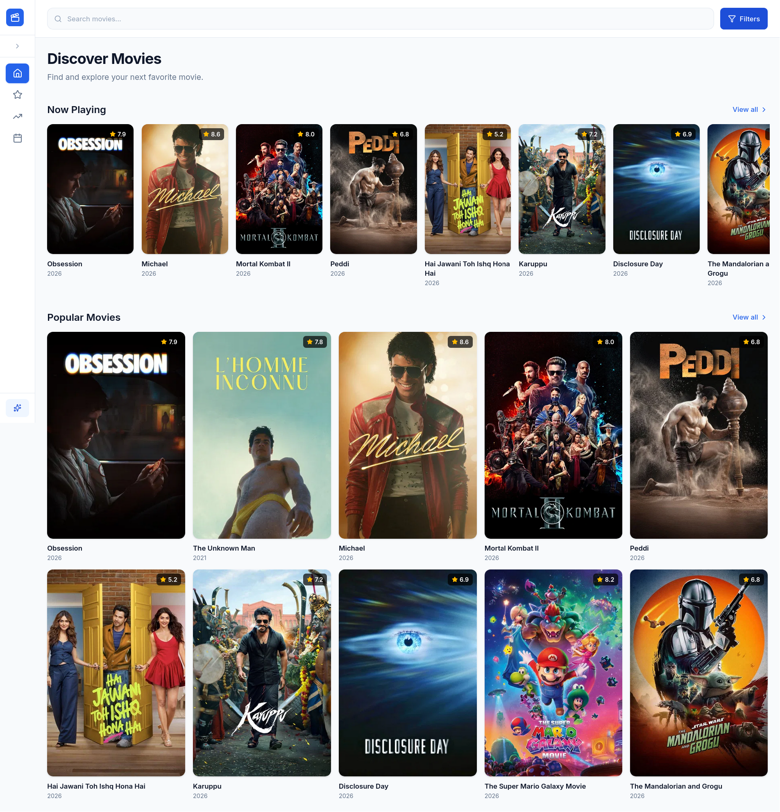

# MovieHub — Movie Discovery Dashboard

A modern movie discovery dashboard built with React, TypeScript, and the TMDB API. Browse trending films, search with filters, and explore detailed movie information — all with polished loading, error, and empty states.

**Live Demo:** [https://movie-discovery-dashboard.vercel.app/](https://movie-discovery-dashboard.vercel.app/)


## Preview



## Features

- **Home Dashboard** — Now Playing and Popular movie sections with horizontal and grid layouts
- **Browse Pages** — Dedicated views for Popular, Top Rated, and Upcoming movies
- **Search & Filters** — Debounced search with genre, year, rating, and sort filters
- **Collapsible Sidebar** — Fixed full-height navigation with icon-only collapsed mode (tablet+)
- **Mobile FAB Nav** — Expandable bottom navigation on small screens
- **Movie Details** — Full movie info, cast, metadata, favorites, and similar movies
- **Async State Handling** — TanStack Query for caching, loading, and error recovery
- **Favorites** — Persist favorite movies in local storage

## Engineering Highlights

This project is structured to meet the assessment's engineering expectations:

| Area | Approach |
| ---- | -------- |
| **Clean architecture** | Separation of concerns across `api/`, `hooks/`, `pages/`, `components/`, and `providers/` |
| **Component reusability** | Shared UI primitives (`Button`, `Spinner`, `PageLoader`), `MovieCard`, `FilterBar`, and layout shell |
| **Maintainable structure** | Feature-based folders, centralized query keys, shared nav config, and URL-driven filter state |
| **Type safety** | Full TypeScript coverage with typed TMDB responses, API errors, and filter models |
| **Async state handling** | TanStack Query with stale-time caching, retries, loading/error/empty states on every data view |
| **API abstraction** | Dedicated Axios client with interceptors; all TMDB endpoints isolated in `movies.api.ts` |

## Tech Stack

| Layer         | Technology                                               |
| ------------- | -------------------------------------------------------- |
| Framework     | React 19 + TypeScript                                    |
| Build         | Vite 8                                                   |
| Styling       | Tailwind CSS 4                                           |
| Data Fetching | TanStack Query v5                                        |
| HTTP Client   | Axios                                                    |
| Routing       | React Router v7                                          |
| API           | [TMDB API](https://www.themoviedb.org/documentation/api) |
| Deployment    | [Vercel](https://vercel.com/)                            |

## Getting Started

### Prerequisites

- Node.js 18+
- A free [TMDB API key](https://www.themoviedb.org/settings/api)

### Installation

```bash
# Clone the repository
git clone <your-repo-url>
cd movie-discovery-dashboard

# Install dependencies
npm install

# Configure environment
cp .env.example .env
# Edit .env and add your TMDB API key

# Start development server
npm run dev
```

Open [http://localhost:5173](http://localhost:5173) in your browser.

### Environment Variables

| Variable            | Description          |
| ------------------- | -------------------- |
| `VITE_TMDB_API_KEY` | Your TMDB API v3 key |

> **Note:** Never commit your `.env` file. For Vercel deployment, add `VITE_TMDB_API_KEY` in your project environment variables.

## Project Structure

```
src/
├── api/              # Axios client, TMDB endpoints, query keys
├── components/
│   ├── layout/       # Sidebar, header, mobile FAB nav, app shell
│   ├── movies/       # Movie cards, grids, sections
│   ├── search/       # Filter controls
│   └── ui/           # Reusable UI primitives
├── context/          # React context definitions
├── hooks/            # Custom React hooks (movies, filters, favorites, layout)
├── pages/            # Route-level page components
├── providers/        # Query, favorites, and layout providers
├── routes/           # React Router configuration
├── types/            # TypeScript interfaces
└── utils/            # Formatters, constants, debounce
```

## Scripts

```bash
npm run dev      # Start dev server
npm run build    # Production build
npm run preview  # Preview production build
npm run lint     # Run ESLint
```

## Branch Strategy

| Branch                              | Purpose                                 |
| ----------------------------------- | --------------------------------------- |
| `main`                              | Stable baseline (Vite + React scaffold) |
| `feature/movie-discovery-dashboard` | Full assessment implementation          |

## API Attribution

This product uses the TMDB API but is not endorsed or certified by TMDB.

## License

MIT
